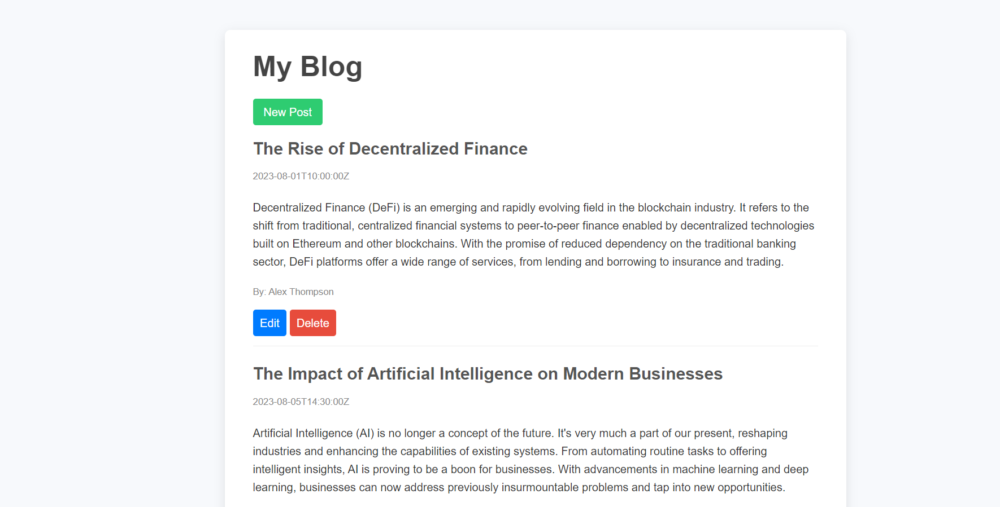

# Project Name: Blog_App

## Blog_App

This repository contains a simple blog application built using HTML, CSS, JavaScript, Node.js, and Express.js.

### Preview

### Features

- Create new blog posts with a title, content, and author name.
- Edit existing blog posts by updating their title, content, and author.
- Delete blog posts that are no longer needed.

### Technologies Used

- HTML5
- CSS3
- JavaScript (Client-side)
- Node.js
- Express.js
- Embedded JavaScript (EJS) for templating
- Axios for making HTTP requests
- MongoDB (optional, not included in this code snippet)

### How to Use

1. Clone the repository to your local machine: git clone https://github.com/KRISHNAKUMARPS2002/Blog_App.git
2. Navigate to the project directory:  
3. Install the required dependencies:
4. Start the server:

5. Open your web browser and go to `http://localhost:3000` to access the blog app.

### Folder Structure

- `public/`: Contains static assets like CSS files and client-side JavaScript.
- `views/`: Contains EJS templates for rendering HTML pages.
- `routes/`: Contains Express.js route handlers for different URLs.
- `models/`: (If using a database) Contains database models/schema definitions.

### Acknowledgments

Special thanks to [OpenAI](https://openai.com) for providing AI-powered assistance in generating this README file.

Feel free to contribute to this project by submitting pull requests or reporting issues. Happy coding! 🚀

---

**Note:** Replace `KRISHNAKUMARPS2002` with your actual GitHub username if you want to clone the repository.

